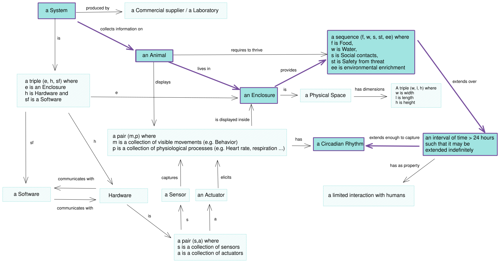

# Home Cage Monitoring Definition Olog

This repository preserves the **Home Cage Monitoring (HCM) Definition Olog**,
a graphical conceptual model developed during Working Group 2 sessions of
[COST Action TEATIME (CA20135)](https://www.cost-teatime.org/). It describes the
main entities and relationships involved in home-cage monitoring, including the
animal, enclosure, environment, sensors, actuators, hardware, software,
behaviour, physiology, and temporal context.

The model follows the Olog approach to knowledge representation while using a
simplified graphical notation. It is a conceptual resource rather than a
deployable OWL ontology.

## View and reuse

| Format | Intended use | File |
| --- | --- | --- |
| PDF | Printable current diagram | [`HCM-OLOG.pdf`](print/HCM-OLOG.pdf) |
| SVG | Scalable current diagram | [`HCM-OLOG.svg`](print/HCM-OLOG.svg) |
| Excalidraw | Editable current source | [`HCM-OLOG-ORIGINAL.excalidraw`](print/HCM-OLOG-ORIGINAL.excalidraw) |
| PNG | Lightweight preview of the earlier diagram | [`2024-08-13_HCM-Definition_COST-TEATIME-20135.PNG`](print/2024-08-13_HCM-Definition_COST-TEATIME-20135.PNG) |

For an immutable snapshot, use the
[`v1.0.0` release](https://github.com/NeuroBAU/HCM-Definition/releases/tag/v1.0.0).

## Context and method

- [Interactive HCM definition and reading guide](https://www.cost-teatime.org/about/hcm-definition/)
- [COST Action TEATIME](https://www.cost-teatime.org/)
- [Spivak and Kent (2012), *Ologs: A Categorical Framework for Knowledge Representation*](https://doi.org/10.1371/journal.pone.0024274)
- [Excalidraw](https://excalidraw.com/), used to author the editable diagram

## Relationship to HCMO

The [Home-Cage Monitoring Ontology (HCMO)](https://github.com/dhuzard/HCMO)
is an independently authored formal ontology informed by this Olog. The Olog
established an important conceptual foundation and domain vocabulary; HCMO
independently formalises and substantially extends the domain using OWL,
established external ontologies, SHACL constraints, competency questions, and
reproducible validation.

## Citation

Please cite this resource using the metadata in [`CITATION.cff`](CITATION.cff)
and identify the specific release used. GitHub's **Cite this repository** menu
can generate APA and BibTeX citations from that file.

## License

The Olog and its repository materials are made available under the
[Creative Commons Attribution-NonCommercial-ShareAlike 4.0 International
license](LICENSE.md) (`CC-BY-NC-SA-4.0`).

